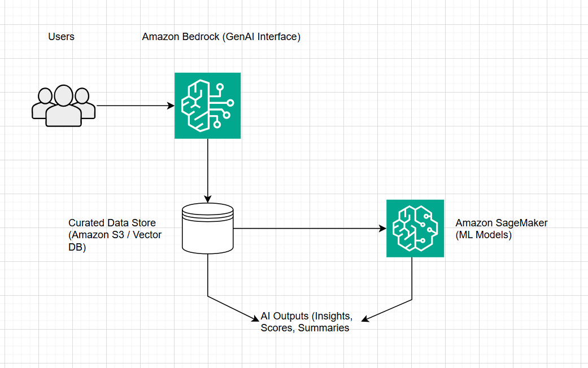

# Architecture Overview

This folder describes the end-to-end architecture and design decisions for the AWS AI system.

## End-to-End Flow

1. Data is ingested from internal sources and external systems.
2. Raw data is stored and processed before being transformed into curated datasets.
3. Curated data is used by Machine Learning models in Amazon SageMaker to generate predictions, classifications, or scores.
4. Outputs from ML models and curated data are made available to Generative AI services.
5. Amazon Bedrock is used to generate explanations, summaries, and natural language interactions based on trusted data and model outputs.
6. Users interact with the system through controlled interfaces rather than direct access to models or data.

This layered approach ensures that Generative AI enhances understanding rather than replacing analytical decision-making.

## Security, Governance, and Cost Awareness

- Data access is controlled using IAM roles and least-privilege principles.
- Sensitive data remains within AWS-managed services and does not leave the environment.
- Curated datasets reduce risk, hallucination, and unnecessary model usage.
- Machine Learning and Generative AI services are used only where they add value.
- Cost is managed by limiting model usage, avoiding always-on resources, and using small, well-scoped workloads.

This design prioritises trust, explainability, and responsible AI usage.
This folder describes the end-to-end architecture and design decisions for the AWS AI system.
## High-Level AWS AI Architecture

This diagram shows a Retrieval-Augmented Generation (RAG) architecture
using AWS-native AI services.

- Amazon Bedrock provides the generative AI interface
- Curated data is stored in Amazon S3 / Vector databases
- Amazon SageMaker is used for ML-based decisions and scoring

